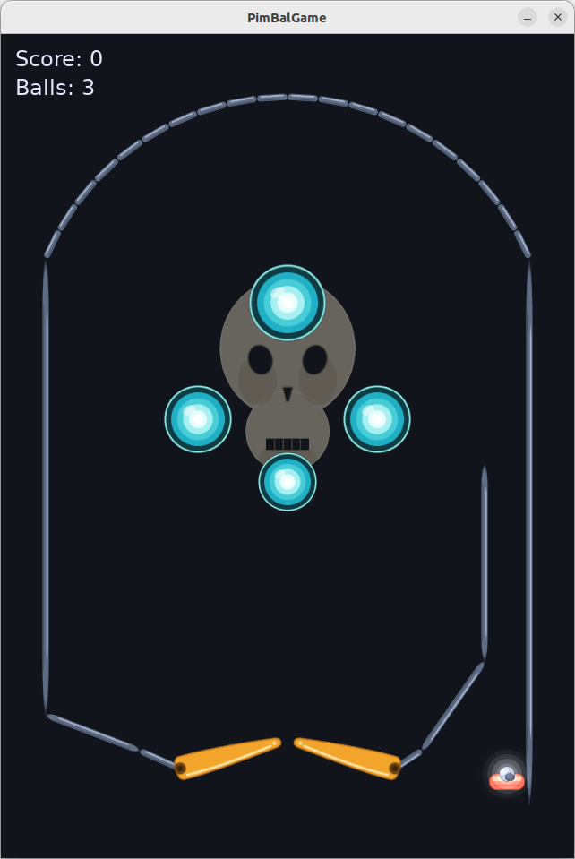

# PimBalGame

A pinball game written in C++17 using the [SFML](https://www.sfml-dev.org/)
library, plus a small set of developer tools for building its art assets. The
game itself ships a complete, self-contained implementation: a custom 2D
physics loop, two flippers, four bumpers, a chargeable plunger launcher,
scoring, three balls per game and a game-over screen.

The game builds SFML in-tree from a git submodule, so no system-wide SFML
installation or `find_package` step is required. It also ships
`tools/svg2png`, a tool that rasterizes SVG art to PNG and packs several PNGs
into a single embeddable C++ texture atlas — see
[tools/svg2png.md](tools/svg2png.md) for its full documentation.



## How this game was made

PimBalGame was designed and implemented end-to-end by an AI coding agent,
[Ornith 1.5 35B-A3B](https://huggingface.co/ornith-ai/Ornith-1.5-35B-A3B) — a
sparse MoE LLM (35B total parameters, ~3B active) — running inside the
[DeepSeek Harness](https://github.com/deepseek-ai/deepseek-harness) agent loop.
Model inference was served locally with
[FreeToken](https://github.com/FlashML-org/FreeToken), a high-throughput
transformer inference engine for sparse models.

| Component        | Tool / Model                                                        |
| ---------------- | ------------------------------------------------------------------- |
| Coding agent     | [Ornith 1.5 35B-A3B](https://huggingface.co/ornith-ai/Ornith-1.5-35B-A3B) |
| Agent harness    | [DeepSeek Harness](https://github.com/deepseek-ai/deepseek-harness)     |
| Inference engine | [FreeToken](https://github.com/FlashML-org/FreeToken)                   |
| Runtime hardware | NVIDIA RTX 5070 Ti (16 GB VRAM), 96 GB DDR4 system RAM              |
| Game library     | [SFML](https://www.sfml-dev.org/) (Graphics, Window, System)        |

## Features

- **Fixed-timestep physics loop.** The simulation runs at a constant
  `1/120 s` sub-step, decoupled from the render rate (capped at 60 FPS), so the
  behaviour is deterministic and stable regardless of frame timing. Large frames
  (e.g. after losing window focus) are clamped to avoid the "spiral of death".
- **Segment-based collision.** The playfield is made of straight wall segments;
  the ball (a circle) resolves against each segment using closest-point projection
  plus impulse-based reflection with per-wall restitution.
- **Flippers.** Two rotating flippers pivot around fixed points and swing between
  a resting and an active angle. Their angular velocity is transferred to the ball
  on contact, and an anti-stick guard prevents the ball from settling in the
  valley formed by an active flipper and the adjacent wall.
- **Bumpers.** Four circular bumpers apply a fixed radial kick and award points on
  contact, flashing briefly to give visual feedback.
- **Plunger launcher.** Hold to charge a spring in the right channel; release to
  launch the ball with a power proportional to the charge.
- **HUD & game loop.** On-screen score, remaining balls and a "Game Over / restart"
  prompt. Three balls per game.
- **Portable font loading.** A bundled font is resolved relative to the executable
  (or source tree) at runtime, falling back gracefully if it is missing.

## Controls

| Action            | Keys                          |
| ----------------- | ----------------------------- |
| Left flipper      | `A`, `Z` or `←` (Left arrow)  |
| Right flipper     | `D` or `→` (Right arrow)      |
| Plunger (hold)    | `Space`                       |
| Restart (game over) | `R`                         |
| Quit              | `Esc` or the window close button |

## Project layout

```
pimbalgame/
├── CMakeLists.txt          # Top-level build configuration
├── dependencies/
│   └── sfml/               # SFML library (git submodule, built in-tree)
├── src/
│   ├── CMakeLists.txt      # Builds the game executable
│   ├── main.cpp            # Program entry point
│   └── pimbalgame/
│       ├── Game.hpp/.cpp   # Window, main loop, input, HUD rendering
│       ├── World.hpp/.cpp  # Playfield geometry, physics, scoring, plunger
│       ├── Physics.hpp     # Shared geometry helper (closest point on a segment)
│       ├── Ball.hpp/.cpp   # The ball: state, gravity integration, speed clamp
│       ├── Flipper.hpp/.cpp# Rotating flipper with angular momentum transfer
│       └── Bumper.hpp/.cpp # Circular scoring bumper with flash effect
├── assets/
│   └── fonts/
│       └── DejaVuSans.ttf  # Bundled HUD font (copied next to the executable)
├── tools/
│   └── svg2png/            # svg2png: SVG→PNG rasterizer + texture-atlas packer
│       ├── CMakeLists.txt
│       ├── main.cpp
│       └── svg2png.md      # Full tool documentation (usage, modes, options)
├── .gitignore
└── README.md
```

## Prerequisites

The game itself needs only a C++17 compiler, CMake and Git. SFML is built
**in-tree** from the git submodule, so you do **not** need a system-wide SFML
installation or a `find_package(SFML)` step. What you *do* need are the low-level
**operating-system libraries** that SFML's `Window` and `Graphics` components link
against. On Linux these come as system packages; on macOS, Windows and Android
SFML fetches the text libraries (Freetype / HarfBuzz) itself and relies on the
platform's OpenGL / Cocoa / Win32 support.

> **CMake version:** the top-level `CMakeLists.txt` requires CMake 3.16, but the
> in-tree SFML submodule (3.1.0) requires **3.28**. CMake takes the higher of the
> two, so in practice **CMake >= 3.28** is needed.

| Requirement      | Minimum / note                                              |
| ---------------- | ----------------------------------------------------------- |
| C++ compiler     | GCC 7+, Clang 5+, or MSVC 2017+ (C++17)                     |
| CMake            | >= 3.28 (enforced by the SFML submodule)                    |
| Git              | for cloning and `git submodule update`                      |
| OpenGL           | system OpenGL implementation (Linux: Mesa / GLVND)          |
| Window system    | X11 (Linux) / Win32 (Windows) / Cocoa (macOS)               |

The project only builds SFML's **System**, **Window** and **Graphics**
components, so the Network and Audio extras (Libssh2, Vorbis, gsm) are **not**
required.

### Linux (Debian / Ubuntu) — verified build

On Linux SFML uses the **system** text libraries by default, so Freetype and
HarfBuzz are required too. Everything below is the exact set that configures and
builds the project cleanly on a fresh machine:

```bash
# Build tools
sudo apt install build-essential cmake git

# SFML Window (X11 backend) — Xrandr, Xcursor and Xi are the only X11
# components SFML 3.1.0 links against; keyboard handling uses XKBlib from libx11-dev
sudo apt install libx11-dev libxi-dev libxrandr-dev libxcursor-dev \
                 libgl-dev libudev-dev

# SFML Graphics text rendering (system Freetype + HarfBuzz)
sudo apt install libfreetype6-dev libharfbuzz-dev
```

> Older SFML 2.6 guides also list `libxinerama-dev` and `libxkbcommon-dev`;
> SFML 3.1.0 does **not** link those here, so they are unnecessary.

Same libraries on other distributions (package *names* differ, the libraries are
the same):

```bash
# Fedora / RHEL (-devel suffix, Mesa as mesa-libGL-devel)
sudo dnf install gcc-c++ cmake git \
    libX11-devel libXi-devel libXrandr-devel libXcursor-devel \
    mesa-libGL-devel libudev-devel freetype-devel harfbuzz-devel

# Arch Linux (runtime + headers merged; base-devel supplies the compiler)
sudo pacman -S base-devel cmake git \
    libx11 libxi libxrandr libxcursor mesa libudev freetype harfbuzz
```

> **Optional:** to avoid installing Freetype / HarfBuzz (and instead let SFML
> download and build them from source via CMake `FetchContent`), configure with
> `-DSFML_USE_SYSTEM_DEPS=OFF`. This needs network access at configure time.

### macOS

Only a compiler, CMake and Git are needed — SFML fetches Freetype / HarfBuzz
itself and uses the platform's OpenGL/Cocoa stack (no X11, no extra system
packages). The simplest path is still Homebrew:

```bash
brew install cmake git          # or: brew install sfml  (prebuilt SFML)
```

### Windows

Install [Visual Studio 2022](https://visualstudio.microsoft.com/) (the **C++
desktop development** workload, which provides MSVC) plus CMake and Git. SFML
fetches the text libraries itself and uses the system OpenGL driver — no extra
system packages are required.

## Getting started

Clone the repository **with submodules** so that SFML is available:

```bash
git clone --recurse-submodules <repo-url> pimbalgame
cd pimbalgame
```

If the submodule is already present, initialize/update it:

```bash
git submodule update --init --recursive
```

### Configure & build (Linux / macOS)

```bash
mkdir -p build
cd build
cmake ..
cmake --build .
```

The executable will be produced at `build/bin/pimbalgame`.

### Configure & build (Windows)

```bat
mkdir build
cd build
cmake .. -G "Visual Studio 17 2022"
cmake --build . --config Release
```

## Running

```bash
./build/bin/pimbalgame   # Linux / macOS
```

On Windows the executable is at `build\Release\pimbalgame.exe`. The bundled font
is copied next to the executable by the build so it can be located at runtime.

## Release notes

The game's developer tool, [`tools/svg2png`](tools/svg2png.md), turns the
project's SVG art into PNG textures and packs them into an embeddable C++
texture atlas. Its full documentation (usage, modes, options, supported SVG)
lives in [tools/svg2png.md](tools/svg2png.md); the tool is summarized here in
the release notes.

| Version | Date       | Summary                                                                                     |
| ------- | ---------- | ------------------------------------------------------------------------------------------- |
| 1.0     | 2026-09-02 | Initial release: a simple pinball game.                                                     |
| 1.1     | 2026-09-02 | Added `tools/svg2png`, a developer tool for turning the game's SVG art into PNG textures.   |
| 1.2     | 2026-09-03 | Embedded texture atlas fed by `svg2png`, plus a particle system for the ball's visual flair.|

### v1.2 (2026-09-03)

- **Embedded texture atlas for the game.** `assets/*.svg` are now the only
  version-controlled art. At build time the `svg2png` tool rasterizes every SVG
  to a transparent PNG and packs them into a single embeddable C++ header
  (`textures.cxxpng`) that the game `#include`s; `src/pimbalgame/Textures.cpp`
  decodes the in-memory atlas and hands out sprites by name. The game ships no
  image files, and falls back to rendering procedural shapes when configured
  without the art tool (`-DBUILD_TOOLS=OFF`).
- **Particles.** An additive-blended particle system gives the ball a soft glow
  halo that brightens with speed, a comet-like trail when moving fast, and short
  bursts of sparks on bumper / flipper contact and on the plunger launch.
- **Physics tweaks.** Refinements to the flipper, bumper and ball handling
  around contact and restitution.

The `svg2png` tool is built only when the project is configured with
`-DBUILD_TOOLS=ON` (default `ON`), wired through the top-level `CMakeLists.txt`.

## License

This project is licensed under the [MIT License](LICENSE).
